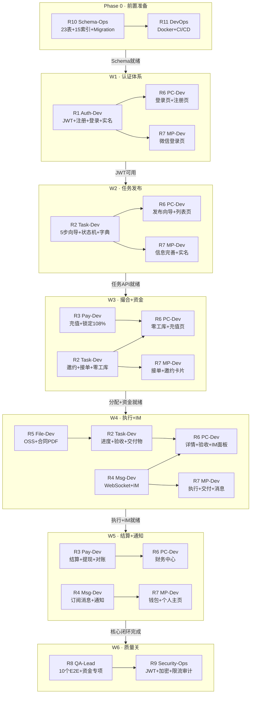
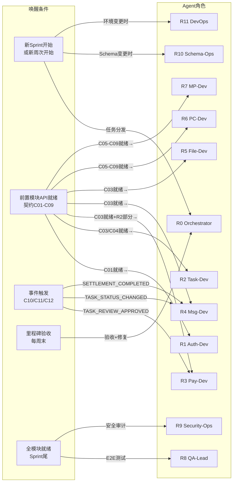

# WeCreator 12-Agent 任务执行流程图

> 本文档定义每个 Agent 何时、何种条件下被唤醒执行，以及彼此间的协同联动机制。

---

## 一、Agent 生命周期状态机

每个 Agent 在整个开发周期中都遵循相同的状态机：

```
Idle(空闲) → Waiting(等待依赖) → Ready(就绪) → Active(激活)
  → Coding(开发) → Testing(自测) → Review(验收) → Done(完成)
  → 回到 Idle 等待下一波次
```

**关键转换条件**：
- `Idle → Waiting`：被 R0 列入当周计划
- `Waiting → Ready`：前置依赖全部就绪（契约签订）
- `Ready → Active`：R0 正式分发任务
- `Review → Done`：R0 里程碑验收通过
- `Active → Blocked`：遇到跨角色阻断（等待其他Agent产出）

---

## 二、Sprint 1 主编排流程（W1-W6）

整体开发按**周波次**推进，每周有明确的主力Agent和前置条件：

### 流程图



---

## 三、Agent 唤醒条件总表

### 唤醒触发器分类



---

## 四、逐角色唤醒条件详表

| Agent | 唤醒时机 | 前置条件 | 产出物 | 通知下游 |
|-------|---------|---------|--------|---------|
| **R0 Orchestrator** | 每周初 / 阻断时 / 里程碑验收 | 无（始终活跃） | 任务分发 + 清单更新 + 仲裁决策 | 全部Agent |
| **R10 Schema-Ops** | Phase 0 / 新表需求时 | Docker环境就绪 | Migration脚本 + 种子数据 | R1~R5（C01/C02） |
| **R11 DevOps** | Phase 0 / W6 / W12 | 无 | Docker + CI/CD + 监控 + 灰度 | 全部（C18） |
| **R1 Auth-Dev** | W1 开始时 | C01 Schema就绪 | JWT + AuthGuard + 15个API | R2~R5（C03/C04）, R6/R7（C05） |
| **R2 Task-Dev** | W2 开始时 | C03/C04 JWT可用 | 状态机 + 25个API + 事件 | R3（C10/C14）, R4（C11）, R5（C15）, R6/R7（C06） |
| **R3 Pay-Dev** | W3 开始时 | C03 JWT + R2任务API部分就绪 | 充值+锁定+结算+15个API | R4（C12）, R6/R7（C07） |
| **R4 Msg-Dev** | W4 开始时 | C03 JWT可用 | WebSocket + IM + 通知 + 10个API | R6/R7（C08/C13） |
| **R5 File-Dev** | W4 开始时 | C03 JWT可用 | OSS直传 + 合同PDF + 5个API | R2（C15）, R6/R7（C09） |
| **R6 PC-Dev** | 每周（与后端同步） | 对应周次的后端API就绪（C05-C09） | Vue3页面 | R8（供测试） |
| **R7 MP-Dev** | 每周（与后端同步） | 对应周次的后端API就绪（C05-C09） | Taro页面 | R8（供测试） |
| **R8 QA-Lead** | W3起（测试框架）/ W6（E2E）/ W10-W11（压测） | 全部API就绪 | 测试报告 + 覆盖率 | R0（C16） |
| **R9 Security-Ops** | W6（加固）/ W11（扫描） | 全部代码就绪 | 安全报告 | R0（C17） |

---

## 五、事件驱动联动链

核心业务流程中，Agent之间通过**3个事件**自动联动：

### 事件链路

```
企业发布任务 → R2 创建+R3 锁定
  → R2 邀约 → R4 推送通知 → R7 展示
  → 零工接单 → R2 状态机 → R5 生成合同
  → 零工执行 → R2 交付物 → R6 验收页面
  → 企业验收 → R2 触发 TASK_REVIEW_APPROVED
    → R3 合规结算 → R3 触发 SETTLEMENT_COMPLETED
      → R4 推送到账通知 → R7 展示
```

### 3个核心事件

| 事件 | 发布者 | 订阅者 | 触发条件 | 订阅者行为 |
|------|--------|--------|---------|-----------|
| `TASK_REVIEW_APPROVED` | R2 | R3 | 企业验收通过交付物 | 发起合规结算，计算税后金额 |
| `TASK_STATUS_CHANGED` | R2 | R4 | 任务任何状态变更 | 推送系统通知+微信订阅消息 |
| `SETTLEMENT_COMPLETED` | R3 | R4 | 结算完成，零工钱包到账 | 推送到账通知给零工 |

---

## 六、R0 Orchestrator 决策流程

R0 是唯一始终活跃的角色，其决策流程如下：

```
每周一启动：
  1. 读取 task-checklist.md 当前进度
  2. 识别本周目标任务（W几）
  3. 检查前置依赖是否就绪
     ├─ 就绪 → 分发任务给对应Agent
     └─ 未就绪 → 识别阻断项 → 协调解决
  4. 周五验收：
     ├─ 全部通过 → 更新清单 → 进入下周
     └─ 有失败 → 回退给对应Agent修复
  5. Sprint结束验收：
     ├─ 通过 → 触发R8/R9质量关
     └─ 有遗留 → 评估是否延期
```

---

## 七、并行度与串行约束

### 可并行的组合

| 并行组 | 说明 |
|--------|------|
| R6 + R7 | 前端PC和小程序可完全并行（消费相同API） |
| R2 + R3 | W3时任务模块和财务模块部分并行 |
| R4 + R5 | W4时消息和文件模块并行 |
| R8 + R9 | W6时测试和安全审计并行 |

### 必须串行的依赖链

```
R10(Schema) → R1(Auth) → R2(Task) → R3(Pay) → R4(Msg)
      ↓                      ↓          ↓
    R11(Docker)           R5(File)   R4(通知)
```

- R1 必须等 R10 的 Schema 就绪
- R2 必须等 R1 的 JWT 中间件就绪
- R3 必须等 R2 的任务API（至少发布+状态机）就绪
- R4 的事件订阅必须等 R2/R3 的事件发布就绪
- R6/R7 每周必须等当周后端API就绪后才能联调
