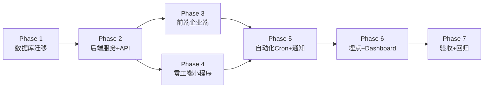
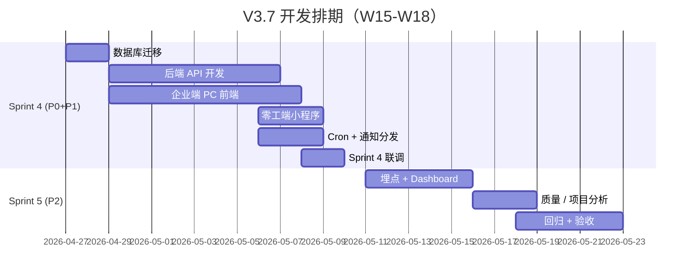

# WeCreator V3.7 修改步骤计划

> **基于文档:** `docs/WeCreator_PRD_V3.7_Project_Task_Enhancement.md`
> **工程结构:** Monorepo（`apps/backend` + `apps/pc-admin` + `apps/worker-mp` + `packages/shared`）
> **总工作量:** ~84 人天（Sprint 4 P0+P1 约 42 人天 / Sprint 5 P2 约 42 人天）
> **生成时间:** 2026-04-21

---

## 总体策略

按 **"数据层 → 服务层 → 接口层 → 前端层 → 自动化/埋点 → 验收"** 的顺序分阶段推进，每个阶段可独立测试。分两个 Sprint 执行：

- **Sprint 4（W15-W16）** → P0 + P1（项目/任务/协作增强）
- **Sprint 5（W17-W18）** → P2（数据分析 + 性能 + 回归）



---

## Phase 1 — 数据库迁移（W15 Day 1-2）

> **目的:** 先做数据层，所有后续代码有 schema 可依赖。使用 `migrations/` 增量迁移脚本，禁止直接改现有表结构。

### Step 1.1 — 扩展现有表字段

**迁移文件:** `apps/backend/migrations/V3_7_001__extend_projects_tasks.sql`

- `projects` 表新增 3 字段：
  - `expected_delivery_date DATE NULL`
  - `phase ENUM('requirement','execution','acceptance') DEFAULT 'requirement'`
  - `risk_level ENUM('green','yellow','red') DEFAULT 'green'`
- `projects.status` 枚举扩展：新增 `planning` / `suspended`；将旧数据 `active` 保持不变（向后兼容）
- `tasks` 表新增 5 字段：
  - `task_no VARCHAR(20) UNIQUE NULL`
  - `priority ENUM('p0','p1','p2') DEFAULT 'p2'`
  - `acceptance_criteria TEXT NULL`
  - `risk_level ENUM('green','yellow','red') DEFAULT 'green'`
  - `acceptance_status ENUM('pending','partial','all_passed') NULL`
- `progress_updates` 表新增 2 字段：`daily_summary VARCHAR(500) NULL` / `tomorrow_plan TEXT NULL`

### Step 1.2 — 新增 6 张表

**迁移文件:** `apps/backend/migrations/V3_7_002__create_new_tables.sql`

| 表 | 关键索引 |
|---|---|
| `milestones` | `(project_id, sort_order)` |
| `milestone_attachments` | `(milestone_id)` |
| `task_checkpoints` | `(task_id, sort_order)` |
| `task_comments` | `(task_id, created_at DESC)` + `(parent_id)` |
| `task_issues` | `(task_id, status)` |
| `notifications` | `(user_id, is_read, created_at DESC)` + `(company_id, created_at DESC)` |

完全按 PRD §6.1 字段定义建表。

### Step 1.3 — 数据回填脚本

**脚本:** `apps/backend/migrations/V3_7_003__backfill_task_no.sql`

- 为历史 `tasks` 记录生成 `task_no`（按 `created_at` 日期 + 自增序号）
- 初始化 `tasks.priority = 'p2'` / `tasks.risk_level = 'green'`
- 初始化 `projects.phase = 'requirement'` / `projects.risk_level = 'green'`

### Step 1.4 — 回滚脚本

为每个迁移文件配套 `down` 脚本，保证可回滚。

**验收:** 本地 DB 执行迁移后，所有现有查询仍可正常返回（兼容性测试）。

---

## Phase 2 — 后端服务 + API（W15 Day 3 ~ W16 Day 3）

> **目的:** 按 PRD §7 输出 16 个新接口 + 扩展现有接口。建议按 **模块** 划分 PR，每个模块独立测试。

### Step 2.1 — 里程碑模块（4 API）

**目录:** `apps/backend/src/modules/milestones/`

- `milestone.entity.ts` / `milestone.service.ts` / `milestone.controller.ts`
- 实现：
  - `GET /api/v1/projects/:id/milestones` — 分页列表
  - `POST /api/v1/projects/:id/milestones`
  - `PUT /api/v1/projects/:id/milestones/:msId`（含"标记完成" + 附件上传）
  - `DELETE /api/v1/projects/:id/milestones/:msId`（仅 `pending` 可删）
- 业务规则：
  - 计划日期 ≥ 今日
  - 单项目最多 10 个里程碑
  - 每里程碑最多 3 个附件（复用 §10.2 现有 OSS 上传能力）

### Step 2.2 — 检查点模块（4 API）

**目录:** `apps/backend/src/modules/checkpoints/`

- 4 个 CRUD 接口
- 状态机: `pending → submitted → passed/rejected → (rejected 回到 submitted)`
- 关键校验：
  - 单任务最多 20 个检查点
  - `revision_count` 超过 3 次拒绝再审核（返回 409）
  - 仅验收人（`reviewer_id`）可执行审核动作
  - 仅零工可执行 submit 动作

### Step 2.3 — 任务评论模块（3 API）

**目录:** `apps/backend/src/modules/task-comments/`

- 核心能力：
  - 嵌套回复（最多 2 层，通过 `parent_id` 判断；写入时校验 parent.parent_id IS NULL）
  - `@提及` 解析（正则 `@用户名` → 生成 `notifications` 记录）
  - 软删除（`is_deleted=true`）
  - 参与者权限：任务创建人 / 已分配零工 / 验收人 / 项目负责人
- 依赖：Phase 5 通知服务

### Step 2.4 — 问题上报模块（3 API）

**目录:** `apps/backend/src/modules/task-issues/`

- 状态机: `open → in_progress → resolved/closed`
- 企业首次回复 → 写入 `first_response_at`，用于 SLA 计算
- 与通知中心联动：
  - 上报时触发 `issue_report` 通知给企业 PM
  - 企业回复时触发 `issue_reply` 通知给上报零工

### Step 2.5 — 通知中心模块（2 API）

**目录:** `apps/backend/src/modules/notifications/`

- `GET /api/v1/notifications?type=&is_read=&page=&size=` — 分页 + 筛选
- `PUT /api/v1/notifications/read` — 支持 `{ids:[]}` 批量 和 `{all:true}` 全部已读
- 通用 `NotificationService.create(...)` 给其他模块调用
- 保留 90 天 + 未读上限 999 → 由 cron 清理（Phase 5）

### Step 2.6 — 扩展现有接口

| 接口 | 改动 |
|---|---|
| `GET /api/v1/tasks` | 新增 `priority` / `risk_level` 筛选，返回字段追加 `task_no`、`priority`、`risk_level` |
| `GET /api/v1/tasks/:id` | 追加 `acceptance_criteria`、`acceptance_status`、`checkpoints[]`、`open_issues_count` |
| `GET /api/v1/projects` | 新增 `phase` / `risk_level` 筛选 + 返回 `milestone_progress`（已完成/总数） |
| `GET /api/v1/projects/:id` | 追加 `milestones[]` + 所有新字段 |
| `POST /api/v1/projects` / `PUT` | 接受 `expected_delivery_date` / `phase` |
| `POST /api/v1/tasks` | 接受 `priority` / `acceptance_criteria`；服务端生成 `task_no` |
| `POST /api/v1/worker/tasks/:id/progress` | 接受 `daily_summary` / `tomorrow_plan` |

### Step 2.7 — 任务编号生成器

**文件:** `apps/backend/src/common/services/task-no-generator.service.ts`

- 基于 Redis `INCR task:seq:YYYYMMDD` 保证原子性
- 格式: `TSK-YYYYMMDD-NNN`（NNN 补零至 3 位，溢出时扩展为 4 位）
- 在 `TasksService.createDraft()` 中调用
- 项目编号同理：`PRJ-YYYYMMDD-NNN`

### Step 2.8 — 权限矩阵接入

按 PRD §8 更新 `@Roles()` 装饰器：

```
里程碑管理 / 检查点管理 → super_admin / task_admin
任务评论 / 问题回复 → super_admin / task_admin / operator
通知中心 → 所有角色
```

**验收:** Postman/集成测试覆盖 16 个新接口 + 8 个扩展接口，通过率 100%。

---

## Phase 3 — 企业端 PC（W15 Day 4 ~ W16 Day 5）

> **目录:** `apps/pc-admin/src/`
> **优先级:** 按 P0 → P1 顺序实施，建议 **2 人并行**（一人做项目看板+里程碑，另一人做任务详情页组件）。

### Step 3.1 — P0 任务信息增强

- `apps/pc-admin/src/pages/task/create/Step2.vue`（或对应文件）
  - 表单顶部只读展示 `任务编号`（创建草稿后从后端返回）
  - "任务名称"下方插入 `优先级` 单选（P0/P1/P2 默认 P2，彩色 Tag）
  - "总体交付目标"下方插入 `验收标准` 富文本（1000 字）
- `apps/pc-admin/src/pages/task/list/TaskTable.vue`
  - 新增列：任务编号 / 优先级 / 风险等级（小图标）
  - 新增筛选器：`priority` 下拉
  - 默认排序支持按 `priority` 权重 + `created_at` DESC

### Step 3.2 — 项目看板页（NEW 路由）

- 新建 `apps/pc-admin/src/pages/project/board/index.vue`
- 路由 `/project/board`，在侧边栏 `📁 项目管理` 下新增入口
- 列表 / 看板视图切换按钮（复用 `/project/list`）
- 卡片组件 `ProjectCard.vue`：
  - 三色预警（根据 `risk_level` 字段）
  - 进度条（由 `milestone_progress` 或任务完成率计算）
  - 里程碑进度 `2/4 ✅`
  - 点击跳转 `/project/:id`
- 筛选：状态 / 负责人 / 阶段 + 搜索
- 响应式：1280/1440/1920 分别 2/3/4 列（用 CSS grid + media query）

### Step 3.3 — 项目详情页里程碑组件

- `apps/pc-admin/src/pages/project/detail/MilestoneList.vue`
- 功能：
  - 列表展示（PRD §2.3 样式）
  - `+ 添加里程碑` 弹窗
  - ✅ 按钮一键标记完成（可同时上传附件）
  - 黄/红色预警标签（由前端根据 `planned_date` + 今日日期计算展示样式，数据由后端返回）

### Step 3.4 — 项目创建/编辑表单增强

- `apps/pc-admin/src/pages/project/ProjectFormModal.vue`
- 新增：`预期交付日期`（DatePicker）+ `项目阶段`（Select，默认"需求确认"）
- 状态下拉扩展：`规划中/执行中/暂停/已完成/已归档`

### Step 3.5 — 任务详情页增强（中栏）

所有组件在 `apps/pc-admin/src/pages/task/detail/` 下：

- `CheckpointPanel.vue` — 📋 检查点可展开面板
  - 企业端：`+ 添加检查点` / 审核通过 / 审核拒绝（填写原因）
  - 逾期/即将到期的颜色标签
- `WorkLogPanel.vue` — 📝 工作日志可展开面板
  - 按日期分组展示零工日报
  - 按角色筛选下拉
  - 支持在日报下方添加评论
- `DeliverableVersionBrowser.vue` — 📦 交付物版本浏览器
  - 版本时间线（展开历史版本）
  - 每版本显示：提交说明 / 附件 / 状态（待验收/已通过/已退回+原因）
  - 当前版本操作：验收通过 / 退回修改
  - **格式自检**：文件选择后前端校验扩展名+大小（见 PRD §3.4 规则表）

### Step 3.6 — 任务详情页增强（讨论 Tab + 问题标记）

- `CommentTab.vue` — 新增「💬 讨论」Tab
  - 评论列表（支持嵌套 2 层）
  - 输入框：@提及（用 `@用户名` 自动补全下拉）+ 附件上传（最多 3 个，≤20MB）
  - 评论作者可删除、企业用户可"标记重要"（黄色高亮）
- `IssueBadge.vue` — 问题上报标记
  - 在角色进度卡片下方展示"⚠️ N个阻塞问题"
  - 点击展开问题详情 + 回复处理 / 标记解决 / 关闭
  - 超时未响应（>24h）显示红色"超时"标签

### Step 3.7 — 通知中心

- `apps/pc-admin/src/components/layout/NotificationBell.vue`
  - 顶栏 🔔 图标 + 未读数徽标
  - Popover 下拉展示最近 10 条
  - 点击跳转到对应实体（task / project / checkpoint / comment）
- `apps/pc-admin/src/pages/notifications/index.vue`
  - 全部通知页（分页 + 类型筛选 + 已读/未读切换）
- 实时推送：接 WebSocket（后端已有），降级方案为 30 秒轮询
- 侧边栏入口 `🔔 通知中心` → `/notifications`

**验收:** 每个组件写 Storybook / 独立单测，且与后端接口联调通过。

---

## Phase 4 — 零工端小程序（W16 Day 3-5）

> **目录:** `apps/worker-mp/`
> **改动较轻**，主要是日报字段扩展 + 检查点提交 + 问题上报。

### Step 4.1 — 工作日报增强

- `apps/worker-mp/src/pages/task/progress/edit.vue`
  - 新增必填 `今日工作摘要`（50-500 字）
  - 新增选填 `明日计划`（多行文本）
  - 现有"详细工作内容"保留
- 提交时 payload 增加 `daily_summary` / `tomorrow_plan`

### Step 4.2 — 检查点提交

- 任务详情页新增「检查点」区域
- 到期前显示"需提交"标记
- 点击提交：填写说明 + 上传附件 → 调用 `PUT /api/v1/tasks/:id/checkpoints/:cpId` with action=submit
- 被拒绝后展示审核意见，允许修改再提交（≤3 次）

### Step 4.3 — 问题上报入口

- 任务详情页「上报问题」按钮（仅 `in_progress` 任务显示）
- 上报表单：标题 / 类型（4选1）/ 描述（50-500 字）/ 附件
- 我的任务列表：有未解决问题时显示 ⚠️ 图标

### Step 4.4 — 评论/@通知

- 零工端任务详情页也加「讨论」Tab（样式适配小程序）
- 被 @ 时通过微信订阅消息推送（复用现有 7 模板中的"评论提醒"或新增）

---

## Phase 5 — 自动化 Cron + 通知分发（W16 Day 4-6）

> **目录:** `apps/backend/src/cron/` 或 `apps/backend/src/modules/scheduler/`

### Step 5.1 — 风险等级计算 Cron（每小时执行）

**文件:** `risk-level.cron.ts`

```
for each active task:
  days_to_deadline = deadline - now
  progress = overall_progress
  if days_to_deadline <= 2 and progress < 80% → red
  elif days_to_deadline <= 5 and progress < 70% → yellow
  else → green
  若等级变化 → 写 notifications('risk_alert') + 埋点 risk_level_change
```

项目层面同理：基于关联任务完成率 + `expected_delivery_date`。

### Step 5.2 — SLA 超时扫描（每 15 分钟）

**文件:** `sla-monitor.cron.ts`

- 检查 `task_issues` WHERE `status=open` AND `first_response_at IS NULL` AND `created_at < NOW()-24h`
  - 设置 `sla_breached=true` → 通知企业 PM "超时未响应"
- 超过 48h → 通知 `super_admin` + 项目负责人

### Step 5.3 — 检查点逾期扫描（每天 00:30）

**文件:** `checkpoint-overdue.cron.ts`

- `planned_date < TODAY AND status='pending'` → `status='overdue'` + 双向通知

### Step 5.4 — 日报缺失扫描（每天 09:00）

**文件:** `daily-missing.cron.ts`

- 对所有 `in_progress` 任务：若零工连续 3 个工作日未提交 `progress_updates`
  - 推送提醒零工 + 通知企业 PM（`daily_missing` 类型）

### Step 5.5 — 里程碑到期扫描（每天 00:30）

**文件:** `milestone-remind.cron.ts`

- 距 `planned_date ≤ 3 天` 且 `status=pending` → 通知项目负责人
- 已超期未完成 → `status=overdue` + 红色标签 + 通知

### Step 5.6 — 通知清理（每天 02:00）

- 删除 `created_at < NOW()-90d` 的记录
- 对 `is_read=false` 超过 999 条的用户，保留最新 999 条

### Step 5.7 — 项目阶段自动流转

在 `TasksService.updateStatus()` 中植入 hook：

- 首个任务 `in_progress` → 项目 `phase='execution'`
- 所有任务 `completed` → 项目 `phase='acceptance'`
- 手动流转优先（有 `phase_manually_set` 标记时不自动改）

**验收:** 在测试环境用假数据触发每种场景，确认通知正确生成。

---

## Phase 6 — 埋点 + Dashboard（Sprint 5, W17）

### Step 6.1 — 埋点事件（11 个）

按 PRD §10 在对应业务入口注入埋点（`@wecreator/shared/analytics`）：

- `milestone_create` / `milestone_complete`
- `checkpoint_create` / `checkpoint_submit` / `checkpoint_review`
- `task_comment_post` / `issue_report` / `issue_resolve`
- `notification_click` / `project_board_view` / `risk_level_change`

### Step 6.2 — Dashboard 升级（§4.7）

**文件:** `apps/pc-admin/src/pages/dashboard/index.vue`

- 新增 4 指标卡：平均完成周期 / 按时交付率 / 接单响应时间 / 本月活跃零工数
- 新增 4 图表（用 ECharts 或 AntV）：任务类型饼图 / 优先级柱状图 / 完成趋势折线 / 零工评分分布
- 后端新增 API：`GET /api/v1/analytics/tasks` / `GET /api/v1/analytics/projects` / `GET /api/v1/analytics/quality`

### Step 6.3 — 项目维度分析

- 环形图（状态概览）/ 预算对比柱状图 / 健康度三色分布
- 复用项目看板数据

### Step 6.4 — 质量分析

- 验收通过率 / 返工率 / 平均返工次数 / 检查点通过率
- 数据源：`deliverable_files`（版本数）+ `task_checkpoints`（审核历史）

---

## Phase 7 — 回归 + 验收（W18）

### Step 7.1 — 验收 Checklist

按 PRD §14 勾选三批验收项：P0（Sprint 3 交付后已做）/ P1（Sprint 4 末）/ P2（Sprint 5 末）。

### Step 7.2 — 非功能性测试

- 项目看板 100 个项目加载 < 2s
- 评论 500 条加载 < 1s
- 风险 cron 执行 < 30s
- 通知 WebSocket 推送延迟 < 2s（降级轮询 30s）

### Step 7.3 — 兼容性回归

- V3.6.1 现有流程全部回归跑通（任务发布 / 接单 / 验收 / 结算 / 争议 / 微信订阅消息）
- 项目 `status='active'` 旧数据映射正确
- 历史任务 `task_no` 回填完整

### Step 7.4 — 权限回归

按 §8 矩阵用 4 种角色账号分别验证。

---

## 文件改动清单速查

| 层 | 新增文件 | 修改文件 |
|---|---|---|
| 数据库 | 3 个迁移脚本 | — |
| 后端 | 5 个新模块（milestones / checkpoints / task-comments / task-issues / notifications）+ 5 个 cron + `task-no-generator` | projects / tasks / progress_updates 模块扩展字段和接口 |
| 企业端 PC | 项目看板页 / MilestoneList / CheckpointPanel / WorkLogPanel / DeliverableVersionBrowser / CommentTab / IssueBadge / NotificationBell / 通知中心页 | 任务 Step2 / TaskTable / 项目表单 Modal / 任务详情页布局 / 侧边栏路由 / Dashboard |
| 零工端 MP | 检查点提交 / 问题上报页 / 讨论 Tab | 任务详情页 / 日报编辑页 / 我的任务列表 |
| shared | `types/milestone.ts` / `types/checkpoint.ts` / `types/notification.ts` / 埋点事件常量 | — |

---

## 排期总览



**并行建议:**
- Phase 1 完成后，Phase 2 和 Phase 3 可并行（前端 Mock 数据开发）
- 后端 5 个模块可拆给 2 人并行（里程碑+检查点 / 评论+问题+通知）
- 前端组件较多，建议 2 人并行（看板+里程碑 / 任务详情页组件）

---

## 风险与缓解

| 风险 | 影响 | 缓解方案 |
|---|---|---|
| 历史数据 `task_no` 回填耗时 | 迁移期间接口慢 | 低峰期执行，分批 UPDATE（每次 1000 条） |
| WebSocket 通知推送稳定性 | 实时性下降 | 降级轮询（30s），保证最终一致 |
| Cron 并发重复执行 | 重复通知 | 用 Redis 分布式锁（`SET NX EX`） |
| `projects.status` 枚举扩展 | 旧前端筛选器失效 | 后端兼容：接受 `active` 作为 alias，返回时统一映射 |
| 前端改动面大（任务详情页） | Bug 风险高 | 每个新组件独立写单测，任务详情页整体走视觉回归 |
| 单用户通知超 999 条 | 性能下降 | Cron 清理 + 查询默认只返回未读前 100 |

---

## 快速开始建议

若你希望立即启动开发，推荐顺序：

1. **先执行 Phase 1**（数据库迁移）— 无依赖，风险低
2. **Phase 2 后端**分两条 PR 并行：
   - PR-A: 里程碑 + 检查点（核心业务）
   - PR-B: 评论 + 问题 + 通知（协作层）
3. **Phase 3 前端**等 PR-A 合并后先做看板+里程碑，再做任务详情页组件
4. **Phase 5 Cron** 在所有业务表就绪后启动
5. **Phase 6/7** 进入 Sprint 5

---

**文档路径:** [plans/V3.7_修改步骤计划.md](/Users/lk/we创客/wecreator/sessions/260421-focal-waterfall/plans/V3.7_修改步骤计划.md)
